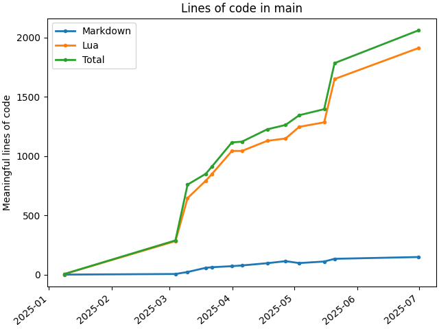

# clocpot (count lines of code, plot over time)

## install dependencies
```
brew install uv
uv pip install
```

## plot all lines of code in the main branch
```sh
uv run main.py /path/to/repo -b main
```

## plot all lines of code and lines in top 10 languages with the most lines in the main branch
```sh
uv run main.py /path/to/repo -b main --all
```

## example output on one of my repos



<!-- ## init (don't run these, I just have them here so I don't forget) -->
<!-- ```sh -->
<!-- set -euo pipefail -->
<!-- uv init -->
<!-- uv add matplotlib -->
<!-- ``` -->
